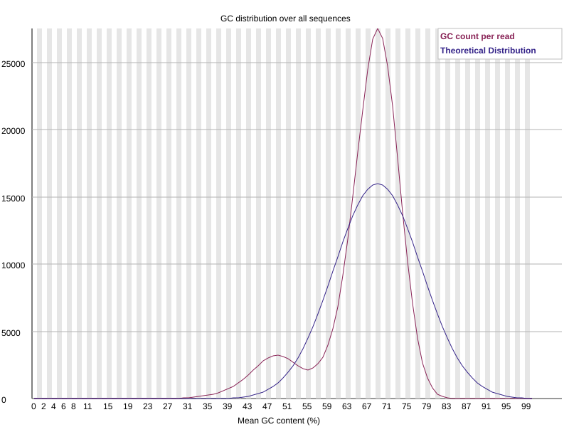

## Project overview

This project is an independent bioinformatic reanalysis of publicly available Illumina sequencing data retrieved from the NCBI Sequence Read Archive (SRA).

The sequencing experiment and generation of the raw data were not performed by me. My contribution consists of the computational analysis, workflow design, interpretation of the results and documentation of the analysis.

## Objectives

The main objectives of the project are to:

- assess the quality of the raw sequencing reads
- investigate the taxonomic composition of the dataset
- remove adapters and low-quality sequence regions
- perform de novo assembly
- evaluate the quality of the resulting assembly
- map the sequencing reads back to the assembled contigs
- investigate the biological composition of the assembled sequences

## Data source

This project uses publicly available Illumina paired-end sequencing data retrieved from the NCBI Sequence Read Archive (SRA).

- **SRA accession:** SRR37017621
- **Sequencing platform:** Illumina MiSeq
- **Sequencing strategy:** Paired-end
- **Original study:** *Comparative genomics of space-resilient Chroococcidiopsis cyanobacteria reveals a core genetic repertoire supporting extreme tolerance towards desert and non-Earth conditions*
- **Authors:** Gabriele Rigano and Daniela Billi
- **Journal:** FEMS Microbes
- **Year:** 2026
- **DOI:** 10.1093/femsmc/xtag036

The sequencing data were generated and deposited by the authors of the original study. The experimental work and generation of the raw sequencing data were not performed as part of this portfolio project.

For this project, the publicly available raw reads were independently downloaded and reanalysed to develop and document a reproducible microbial genomics workflow.

## Raw data quality control

The quality of the raw paired-end reads was assessed using **FastQC**, while **MultiQC** was used to aggregate the individual quality-control reports into a single summary.

The raw dataset showed generally high sequencing quality, with per-base quality scores remaining high across most of the read length.

### Quality-control summary

The raw sequencing dataset contained **705,422 paired-end read pairs**.

FastQC and MultiQC showed:

- generally high per-base sequencing quality
- median quality scores above approximately **Q24** across the reads
- similar quality profiles between R1 and R2
- a bimodal GC-content distribution, with peaks around **49%** and **69%**
- a heterogeneous sequence-length distribution, with major read-length populations around **210 bp** and **250 bp**

These observations suggested that the dataset contained sequencing reads originating from more than one genomic background rather than from a single homogeneous isolate.

The main observations were:

- overall high per-base sequence quality
- similar quality profiles between forward and reverse reads
- a warning in the GC-content distribution, with two distinct peaks
- a warning in the sequence-length distribution, reflecting heterogeneous read lengths
- no major indication of severe sequencing-quality degradation

The presence of two GC-content peaks suggested that the dataset might contain DNA from organisms with different genomic compositions. This observation was therefore investigated further using taxonomic classification.

### GC-content distribution



The GC-content distribution shows a clear bimodal profile, with major peaks around approximately **49%** and **69% GC**. This deviation from a single approximately normal distribution suggests that the dataset may contain sequences originating from organisms with different genomic compositions.

### Tools used

- **FastQC** — individual read-quality assessment
- **MultiQC** — aggregation and comparison of FastQC reports

### Interpretation

The quality-control results indicated that the dataset was suitable for downstream analysis. However, the non-unimodal GC-content distribution suggested that the sequencing data might not originate from a single homogeneous genome.

For this reason, taxonomic profiling was performed before genome assembly.

## Taxonomic profiling

Taxonomic classification of the raw sequencing reads was performed using **Kraken2**.

Approximately **34.35%** of the reads were classified, while **65.65%** remained unclassified.

Among the classified reads, the most abundant assignments included:

- **Chroococcidiopsis** — approximately 4.54%
- **Roseococcus** — approximately 3.39%
- **Brevundimonas** — approximately 2.71%
- **Porphyrobacter** — approximately 1.16%
- **Erythrobacter** — approximately 0.97%
- **Mesorhizobium** — approximately 0.65%
- **Streptomyces** — approximately 0.48%
- **Microbacterium** — approximately 0.42%
- **Luteimonas** — approximately 0.35%
- **Pseudomonas** — approximately 0.34%

### Interpretation

The taxonomic profile supports the hypothesis suggested by the bimodal GC-content distribution: the sequencing dataset does not appear to represent a single homogeneous genomic source.

The presence of multiple bacterial genera indicates a complex microbial composition, which is important to consider when choosing the downstream assembly strategy.

For this reason, **metaSPAdes** was selected instead of a standard isolate-genome assembly workflow.

## Read trimming and quality filtering

Adapter removal and quality filtering were performed using **fastp**.

The filtering strategy included:

- automatic paired-end adapter detection
- right-end quality trimming
- a sliding window of 4 bases
- minimum mean quality threshold of Q20
- minimum retained read length of 100 bp

The main fastp parameters were:

```bash
--detect_adapter_for_pe
--cut_right
--cut_right_window_size 4
--cut_right_mean_quality 20
--length_required 100
--thread 4
```

## De novo assembly

The quality-filtered reads were assembled de novo using **metaSPAdes**.

A metagenomic assembler was selected because both the FastQC GC-content profile and Kraken2 taxonomic classification suggested that the sequencing dataset contained DNA from multiple genomic sources.

### Assembly quality assessment

Assembly statistics were evaluated using **QUAST**.

The main results were:

- **Total assembly length:** 33,286,655 bp
- **Number of contigs ≥ 1 kb:** 6,861
- **Number of contigs ≥ 5 kb:** 807
- **Number of contigs ≥ 10 kb:** 349
- **Number of contigs ≥ 25 kb:** 149
- **Number of contigs ≥ 50 kb:** 62
- **Largest contig:** 328,308 bp
- **N50:** 3,810 bp
- **N90:** 701 bp
- **L50:** 1,244
- **L90:** 10,480
- **GC content:** 62.96%
- **Ambiguous bases (N):** 0

### Interpretation

The assembly was highly fragmented, as indicated by the relatively low **N50** and the large number of contigs required to reconstruct half of the assembly.

The total assembly size of approximately **33.3 Mb** is also much larger than expected for a single cyanobacterial genome.

Together with the taxonomic classification results, this supports the interpretation that the sequencing dataset contains a mixed microbial community rather than a single pure genomic isolate.

The absence of ambiguous bases indicates that the assembler did not introduce unresolved nucleotide positions into the contigs.

## Read mapping

The quality-filtered paired-end reads were aligned back to the assembled contigs using **BWA-MEM**.

The resulting alignment files were processed with **SAMtools** to inspect pairing information and insert-size statistics.

### Insert-size distribution

The mapped paired-end reads showed the following approximate insert-size statistics:

- **25th percentile:** 304 bp
- **Median:** 376 bp
- **75th percentile:** 467 bp
- **Mean insert size:** 389.8 bp
- **Standard deviation:** 123.1 bp

These values were broadly consistent with the expected fragment-size distribution of the sequencing library.

### Interpretation

Mapping the reads back to the assembly provides an additional quality-control step by evaluating how well the assembled contigs represent the original sequencing data.

The observed insert-size distribution was compatible with paired-end Illumina sequencing and did not indicate major abnormalities in library structure.

Further mapping statistics, such as the percentage of mapped reads and properly paired reads, can be incorporated to obtain a more complete assessment of assembly support.

## Analysis workflow

```text
NCBI SRA
    ↓
Raw FASTQ files
    ↓
Quality Control
FastQC + MultiQC
    ↓
Taxonomic Profiling
Kraken2
    ↓
Read Trimming and Filtering
fastp
    ↓
De novo Assembly
metaSPAdes
    ↓
Assembly Quality Assessment
QUAST
    ↓
Read Mapping
BWA-MEM + SAMtools
    ↓
Downstream Genomic Analysis
```

## Tools and software

The analysis was performed using the following bioinformatics tools:

- **FastQC** — quality assessment of raw sequencing reads
- **MultiQC** — aggregation and visualization of quality control reports
- **Kraken2** — taxonomic classification of sequencing reads
- **fastp** — adapter trimming and quality filtering
- **metaSPAdes** — de novo assembly of the sequencing dataset
- **QUAST** — assessment of assembly quality
- **BWA-MEM** — alignment of sequencing reads to the assembled contigs
- **SAMtools** — processing and inspection of alignment files

## Reproducibility

All major analysis steps, software versions, parameters and commands used in the workflow will be documented in this project.

The complete analysis scripts will also be made available through GitHub.

## Project status

The analysis is currently in progress. Results, figures and biological interpretation will be added progressively as each stage of the workflow is completed.