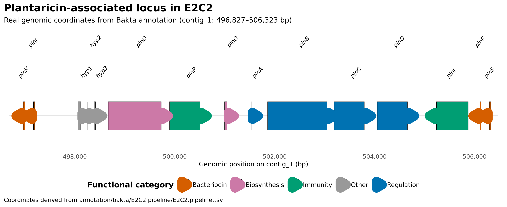
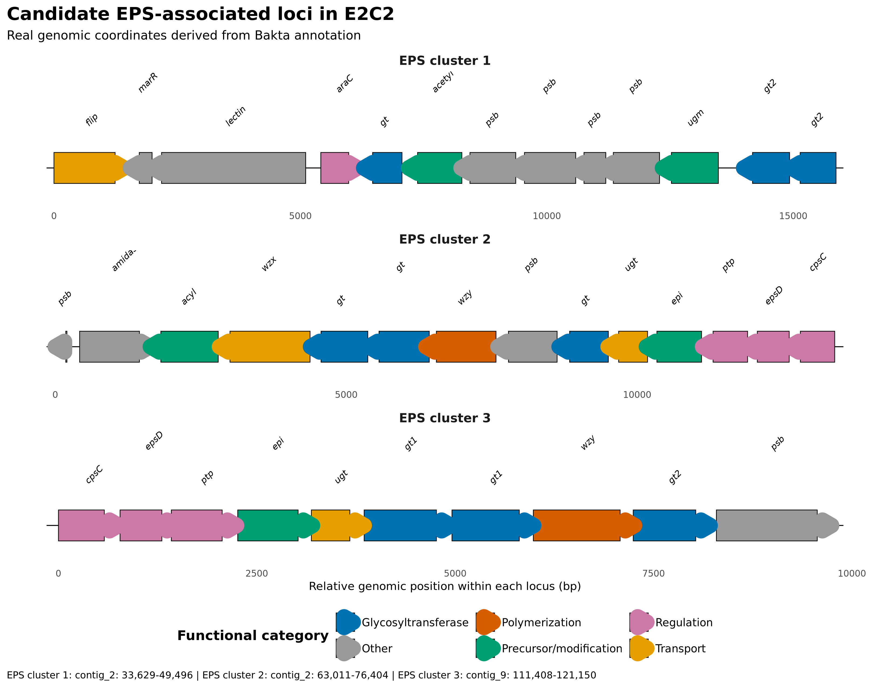
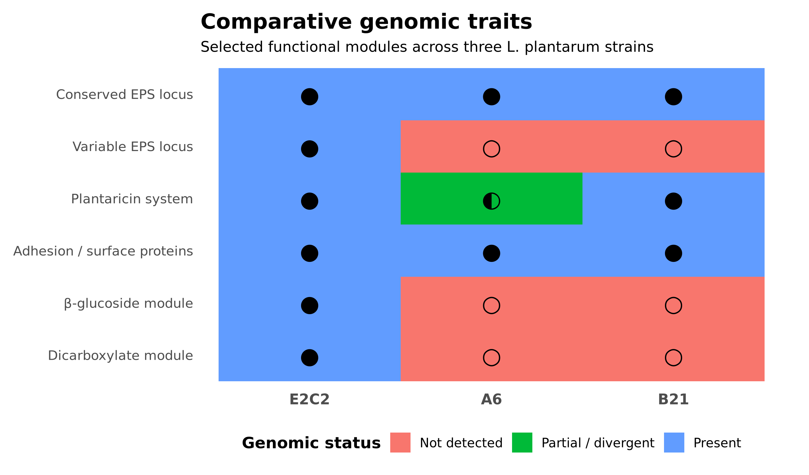
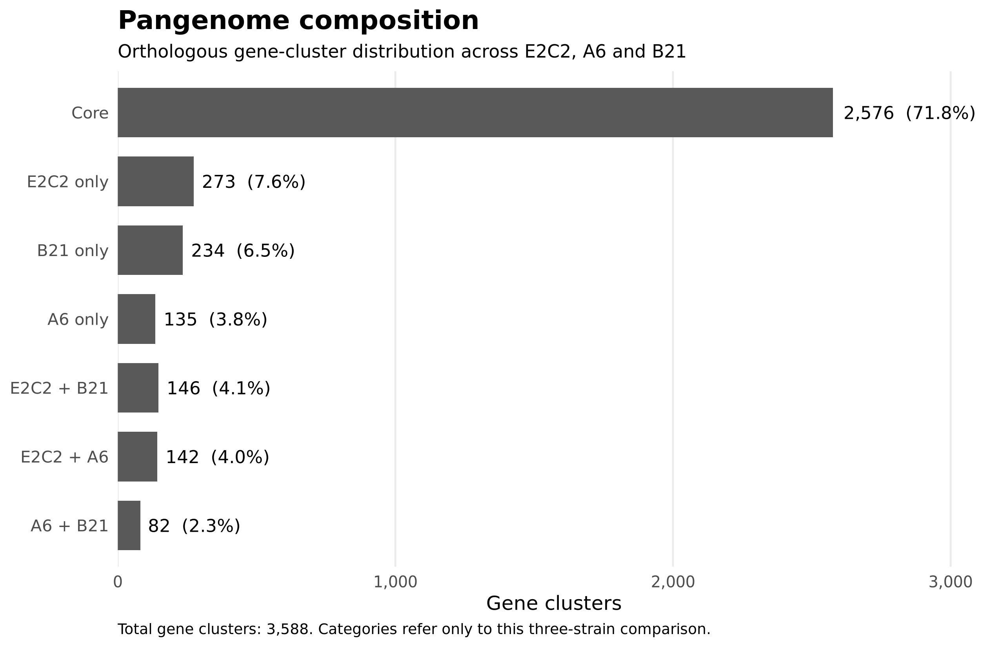

## Project overview

This project presents an independent, reproducible genomic characterization of *Lactiplantibacillus plantarum* E2C2 using publicly available Illumina whole-genome sequencing data.

The analysis integrates read quality control, taxonomic assessment, de novo genome assembly, genome-quality evaluation, chromosome and plasmid reconstruction, species confirmation, functional annotation, genomic safety screening and comparative genomics.

Particular attention was given to traits relevant to food biotechnology and potential probiotic applications, including bacteriocin-associated loci, stress-response systems, carbohydrate utilization, adhesion-associated proteins, exopolysaccharide biosynthesis and fermentation-related metabolic functions.

The complete analysis was implemented as a modular **Snakemake workflow** [@koster2012snakemake] using isolated Conda environments to support reproducibility and dependency management.

## Project objectives

The project was designed to:

- reconstruct and evaluate the E2C2 genome from public Illumina sequencing data
- confirm its taxonomic identity using complementary read- and genome-level approaches
- distinguish chromosome- and plasmid-associated genomic components
- assess genome completeness, contamination and annotation quality
- investigate genomic safety-related features
- characterize functional traits relevant to stress adaptation, antimicrobial competition, carbohydrate metabolism, adhesion and polysaccharide biosynthesis
- investigate technological traits relevant to fermentation
- compare E2C2 with additional *L. plantarum* strains to distinguish conserved and strain-variable genomic features
- integrate the complete analysis into a reproducible Snakemake workflow

## Key findings

The integrated genomic analysis of *Lactiplantibacillus plantarum* E2C2 highlighted several major features:

- **Species identity confirmed:** whole-genome ANI showed **99.01% identity to *L. plantarum***, clearly separating E2C2 from closely related species.
- **High-quality genome reconstruction:** the assembly reached **100% estimated completeness**, with an **N50 of 271,950 bp**.
- **Favourable genomic safety profile:** no reportable antimicrobial-resistance determinants, major virulence factors or major biogenic-amine pathways were detected in the targeted screening.
- **Plantaricin-associated potential:** E2C2 carries a highly conserved plantaricin locus containing regulatory, immunity and bacteriocin-associated components, including **PlnEF** and **PlnJK**.
- **Stress-adaptation repertoire:** the genome encodes multiple heat-shock, proteostasis, redox, acid-stress and bile-associated functions.
- **Surface and EPS potential:** several adhesion-associated proteins and **three candidate polysaccharide biosynthesis clusters** were identified, including **two high-confidence EPS-associated loci**.
- **Fermentation-related metabolism:** E2C2 carries genomic capacity for L- and D-lactate metabolism, acetoin-associated metabolism and extensive peptide uptake and intracellular proteolysis.
- **Substantial accessory-genome diversity:** comparative analysis with strains A6 and B21 identified **273 E2C2-specific gene clusters**, including variable EPS-associated, β-glucoside-utilization, dicarboxylate-metabolism and mobile-element modules.

## Read preprocessing and quality filtering

Raw Illumina paired-end reads were processed using **fastp 1.3.6** [@chen2018fastp], followed by quality assessment using **FastQC 0.12.1** [@andrewsFastQC] and aggregation of the final reports with **MultiQC** [@ewels2016multiqc].

### Raw sequencing data

Before filtering, the dataset contained:

- **Total reads:** 3,291,512
- **Total bases:** 654,679,422 bp
- **Q20 bases:** 84.70%
- **Q30 bases:** 72.82%
- **Mean R1 length:** 196 bp
- **Mean R2 length:** 201 bp
- **GC content:** 43.60%

### Filtering results

| Metric | Raw reads | Filtered reads |
|---|---:|---:|
| Total reads | 3,291,512 | 2,143,970 |
| Total bases | 654,679,422 | 408,347,089 |
| Q20 bases | 84.70% | 96.55% |
| Q30 bases | 72.82% | 88.37% |
| Mean read length R1 | 196 bp | 201.7 bp |
| Mean read length R2 | 201 bp | 179.2 bp |
| GC content | 43.60% | 43.17% |
| Duplication rate | — | 0.94% |

<br>

Reads removed during filtering included:

<br>

| Filtering outcome | Reads |
|---|---:|
| Reads passing filters | 2,143,970 |
| Reads too short | 1,123,774 |
| Low-quality reads | 23,566 |
| Reads with too many N bases | 6 |
| Adapter-dimer reads | 196 |

### Read-preprocessing interpretation

Preprocessing substantially improved the overall quality of the sequencing dataset.

The proportion of bases reaching **Q20 increased from 84.70% to 96.55%**, while **Q30 increased from 72.82% to 88.37%**.

Approximately **65% of the original reads** were retained. Most rejected reads were removed because they fell below the minimum retained length after trimming, rather than because of globally poor sequence quality.

The GC content remained highly stable before and after preprocessing (**43.60% vs 43.17%**), indicating that filtering did not substantially alter the overall nucleotide composition of the dataset.

The final paired-end reads showed different mean lengths, with approximately **201.7 bp for R1** and **179.2 bp for R2**, reflecting more extensive trimming of the reverse reads.

A dedicated MultiQC report was generated using only the final preprocessing outputs to avoid mixing exploratory trimming tests with the definitive workflow results.

## Dataset

This project uses publicly available whole-genome sequencing data from *Lactiplantibacillus plantarum* strain **E2C2**, originally isolated from the human gut.

The sequencing data were retrieved from the European Nucleotide Archive (ENA) and independently reanalysed as part of this portfolio project.

- **Strain:** E2C2
- **Species:** *Lactiplantibacillus plantarum*
- **Run accession:** ERR1158396
- **Study accession:** PRJEB11980
- **Sample accession:** SAMEA3684370
- **Experiment accession:** ERX1231803
- **Sequencing platform:** Illumina MiSeq
- **Library layout:** Paired-end
- **Sequencing strategy:** Whole Genome Sequencing (WGS)
- **Library source:** Genomic DNA
- **Number of paired-end reads:** 1,645,756
- **Total reads (R1 + R2):** 3,291,512
- **Total sequenced bases:** 654,679,422 bp
- **Original study:** *WGS of Lactobacillus plantarum isolated from human gut*
- **Depositing institution:** Justus Liebig University

The two paired-end FASTQ files used in the analysis were stored locally as:

```text
E2C2_R1.fastq.gz
E2C2_R2.fastq.gz
```

with compressed file sizes of approximately **252 MB** and **280 MB**, respectively.

The raw sequencing data and the original experimental work were not generated as part of this portfolio project. My contribution consists of the independent computational reanalysis, workflow development, genomic characterization, interpretation and documentation of the publicly available dataset.

### Original publication

The E2C2 strain was originally described by Suryavanshi et al. [@suryavanshi2017e2c2].

**Suryavanshi MV, Paul D, Doijad SP, Bhute SS, Hingamire TB, Gune RP, et al.**  
*Draft genome sequence of Lactobacillus plantarum strains E2C2 and E2C5 isolated from human stool culture.*  
Standards in Genomic Sciences, 2017.

The published E2C2 draft genome was approximately **3.60 Mb**, with a reported **GC content of 43.99%**.

These published values provide an external reference against which the independently reconstructed genome can be compared.

## Taxonomic assessment

Taxonomic classification of the quality-filtered sequencing reads was performed using **Kraken2** [@wood2019kraken2] to evaluate whether the dataset was consistent with the expected taxonomic identity of the E2C2 strain and to identify potential evidence of contamination.

### Kraken2 results

The main taxonomic assignments were:

- **Classified sequences:** 91.78%
- **Unclassified sequences:** 8.22%
- **Lactobacillaceae:** 90.18%
- **Lactiplantibacillus:** 79.72%
- ***Lactiplantibacillus plantarum*:** 40.06%
- ***L. plantarum* clade assignments:** 429,468

Most classified sequences were therefore assigned within the expected lactic-acid-bacterium lineage.

At species level, *Lactiplantibacillus plantarum* represented the dominant assignment. Smaller fractions were assigned to closely related species, including *Lactiplantibacillus argentoratensis*, *Lactiplantibacillus pentosus* and *Lactiplantibacillus paraplantarum*.

### Taxonomic interpretation

The taxonomic profile was strongly consistent with the expected identity of the E2C2 dataset.

More than **90% of classified sequences belonged to Lactobacillaceae**, while approximately **80% were assigned to the genus Lactiplantibacillus**.

The lower proportion assigned directly to *L. plantarum* at species level should not be interpreted as evidence that only 40% of the dataset originated from this species. Read-level k-mer classifiers such as Kraken2 may assign sequences from closely related taxa to higher taxonomic ranks when species-specific sequence information is insufficient.

For this reason, Kraken2 was used primarily as an initial taxonomic and contamination-screening step. Species identity was subsequently evaluated using genome-level approaches after de novo assembly.

## De novo genome assembly and quality assessment

The quality-filtered paired-end reads were assembled de novo using **SPAdes 3.15.5** [@bankevich2012spades] in careful mode.

The assembly was generated using automatic k-mer selection, 4 CPU threads and an 8 GB memory limit.

### Assembly statistics

Assembly quality was assessed using **QUAST 5.3.0** [@gurevich2013quast].

The main assembly metrics were:

| Metric | Value |
|---|---:|
| Total assembly length | 3,771,999 bp |
| Number of contigs | 172 |
| Contigs ≥1 kb | 59 |
| Contigs ≥10 kb | 30 |
| Contigs ≥50 kb | 16 |
| Largest contig | 619,211 bp |
| N50 | 271,950 bp |
| N90 | 50,973 bp |
| L50 | 5 |
| L90 | 16 |
| GC content | 43.99% |

<br>

Genome-quality estimates:

<br>

| Quality metric | Value |
|---|---:|
| Estimated completeness | 100% |
| Estimated contamination | 4.77% |
| CheckM2 genome size | 3,799,521 bp |
| Coding density | 84.2% |
| Predicted CDSs | 3,769 |

### Assembly-quality interpretation

The independently reconstructed E2C2 genome showed a high degree of continuity, with an **N50 of approximately 272 kb** and only five contigs required to account for half of the assembled sequence.

The reconstructed genome size of approximately **3.8 Mb** and the **43.99% GC content** were highly consistent with the previously published E2C2 draft genome, which was reported to be approximately 3.60 Mb with a GC content of 43.99%.

**CheckM2** [@chklovski2023checkm2] estimated the genome to be essentially complete...

This result motivated additional genome-level taxonomic assessment and inspection of chromosomal and plasmid-associated sequences in subsequent stages of the analysis.

## Read mapping and chromosome coverage

Quality-filtered paired-end reads were mapped against the chromosome-associated assembly to evaluate read support and coverage across the reconstructed genome.

### Mapping statistics

The alignment produced the following results:

| Mapping metric | Value |
|---|---:|
| Primary reads | 2,143,970 |
| Primary mapped reads | 1,926,527 |
| Primary mapping rate | 89.86% |
| Total mapped alignments | 1,950,902 |
| Overall mapping rate | 89.97% |
| Properly paired reads | 1,897,666 |
| Proper-pair rate | 88.51% |
| Singletons | 4,873 |
| Singleton rate | 0.23% |

### Coverage assessment

| Coverage feature | Interpretation |
|---|---|
| Major contigs | Broadly covered across their full length |
| Typical depth | Approximately 80-115× on major contigs |
| NODE_3 | High apparent coverage but low mapping quality, consistent with a repetitive or structurally ambiguous region |
<br><br>
Examples include:

- **NODE_1 (619,211 bp):** mean depth ~103×
- **NODE_2 (422,966 bp):** mean depth ~90×
- **NODE_4 (283,149 bp):** mean depth ~96×
- **NODE_5 (271,950 bp):** mean depth ~85×
- **NODE_6 (255,977 bp):** mean depth ~90×
- **NODE_7 (235,913 bp):** mean depth ~80×
- **NODE_8 (207,316 bp):** mean depth ~89×
- **NODE_10 (144,027 bp):** mean depth ~102×

### Mapping and coverage interpretation

Approximately **90% of the quality-filtered reads mapped back to the chromosome-associated assembly**, with **88.51% mapping as proper pairs**.

Together with the high sequencing depth and complete coverage of the major contigs, these results provide strong read-level support for the reconstructed chromosome.

Coverage was not completely uniform across the assembly. Some smaller contigs showed substantially elevated depth, which may reflect repetitive regions, copy-number variation or sequences with different genomic abundance.

In addition, one large contig, **NODE_3**, showed high sequence coverage but an unusually low mean mapping quality despite substantial read depth. This suggests that many reads mapping to this region may also align well elsewhere in the assembly, and the region therefore requires cautious interpretation.

## Plasmid reconstruction and mobile elements

The de novo assembly was further analysed using **MOB-suite** [@robertson2018mobsuite] to distinguish chromosome-associated contigs from putative plasmid-associated sequences.

MOB-suite reconstructed a main chromosome-associated component and identified **five candidate plasmid components**.

### Candidate plasmids

The reconstructed plasmid-associated components were:

- **AB793:** 65,149 bp, 11 contigs — predicted as **mobilizable**
- **novel_b355...:** 56,904 bp, 2 contigs — predicted as **conjugative**
- **AD789:** 21,636 bp, 3 contigs — predicted as **mobilizable**
- **novel_777...:** 10,959 bp, 2 contigs — predicted as **mobilizable**
- **AE885:** 9,298 bp, 2 contigs — predicted as **non-mobilizable**

Several of these components contained plasmid-associated markers such as replicons and relaxases.

The approximately **56.9 kb novel_b355 component** showed the strongest evidence of autonomous mobility, containing:

- a plasmid replicon
- **MOBQ** relaxase-associated signatures
- an **MPF_T** mating-pair formation system
- a predicted **conjugative** mobility classification

Its closest Mash neighbour in the MOB-suite database was associated with *Lactiplantibacillus plantarum*.

### Plasmid reconstruction interpretation

The MOB-suite results indicate that part of the E2C2 accessory genome is likely associated with plasmid-derived sequences.

Importantly, these components should not automatically be interpreted as contamination. Plasmids are biologically relevant components of bacterial genomes and may carry genes involved in adaptation, metabolism, stress response or horizontal gene transfer.

The identification of plasmid-associated contigs also provided a plausible explanation for some of the elevated sequencing-depth patterns observed during coverage analysis.

Because MOB-suite reconstructs plasmid candidates computationally from draft assemblies, the five components are reported here as **putative plasmid-associated replicons rather than experimentally confirmed complete plasmids**.

## Species confirmation by average nucleotide identity

Genome-level taxonomic identification was performed using **fastANI 1.34** [@jain2018fastani].

The E2C2 assembly was compared against reference genomes from three closely related species:

- *Lactiplantibacillus plantarum*
- *Lactiplantibacillus paraplantarum*
- *Lactiplantibacillus pentosus*

### ANI results

The genome-wide comparisons produced:

| Reference species | ANI to E2C2 | Interpretation |
|---|---:|---|
| *Lactiplantibacillus plantarum* | 99.01% | Strong species-level match |
| *Lactiplantibacillus paraplantarum* | 87.73% | Clearly below species-level identity |
| *Lactiplantibacillus pentosus* | 82.81% | Clearly below species-level identity |
<br><br>

For the *L. plantarum* comparison, fastANI identified matching sequence across 985 of 1,223 query fragments used in the analysis.

### Species-identification interpretation

The E2C2 genome showed a clear and substantially higher nucleotide identity to the *L. plantarum* reference genome than to the other closely related species tested.

An ANI of approximately **99.01%** strongly supports assignment of E2C2 to *Lactiplantibacillus plantarum*.

This genome-level result was consistent with the earlier Kraken2 read classification, but provided substantially greater species-level resolution.

Together, read-level taxonomic profiling, genome composition and whole-genome ANI therefore provided independent lines of evidence supporting the taxonomic identification of E2C2 as *Lactiplantibacillus plantarum*.

## Genome annotation

The chromosome-associated component reconstructed by MOB-suite was functionally annotated using **Bakta 1.12.1** with the **Bakta light database v6.0**.

The annotation was integrated directly into the Snakemake workflow, ensuring that downstream safety and functional analyses used the same standardized genome annotation.

### Annotation summary

The chromosome-associated assembly contained:

| Annotation metric | Value |
|---|---:|
| Chromosomal sequence length | 3,635,575 bp |
| Number of contigs | 152 |
| GC content | 44.1% |
| N50 | 271,950 bp |
| N90 | 73,406 bp |
| Coding density | 84.0% |
| CDSs | 3,460 |
| tRNAs | 84 |
| rRNAs | 8 |
| tmRNA | 1 |
| ncRNAs | 11 |
| ncRNA regions | 37 |
| Hypothetical proteins | 504 |
| Pseudogenes | 0 |
| CRISPR arrays | 0 |
<br><br>

### Annotation interpretation

The chromosome-associated genome showed a high coding density, with approximately **84% of the sequence assigned to protein-coding regions**.

Most predicted CDSs could be associated with known or putative biological functions, while **504 proteins remained annotated as hypothetical**, indicating coding regions for which no sufficiently specific functional assignment was available.

The Bakta annotation served as the central reference for downstream analyses, including antimicrobial-resistance screening, virulence assessment, stress-response genes, carbohydrate utilization, adhesion-associated proteins, exopolysaccharide loci and plantaricin-associated systems.

## Genomic safety assessment

The E2C2 genome was screened for genomic features potentially relevant to microbial safety, including antimicrobial resistance determinants, virulence-associated genes, biogenic-amine pathways, prophages and plasmid-associated risk determinants.

### Antimicrobial resistance

**AMRFinderPlus** [@feldgarden2021amrfinderplus] detected **no reportable antimicrobial resistance determinants** in the analysed genome.

One additional determinant, **clpL**, was identified and classified as a heat-stress-associated gene rather than an antimicrobial-resistance gene.

The ClpL protein showed:

- **100% reference coverage**
- **97.44% amino-acid identity**

This protein is associated with cellular stress response and protein quality control.

### Virulence-associated genes

Dedicated similarity screening against **VFDB** [@liu2019vfdb] was used to investigate potential virulence-associated proteins.

Initial similarity hits were evaluated according to sequence identity, reference coverage and genomic context.

No convincing evidence for intact major virulence determinants was identified in the chromosome-associated genome.

### Biogenic amine pathways

Targeted annotation and homology-based screening was performed for major pathways associated with biogenic-amine production.

No convincing homologues were detected for:

- **HdcA** — histamine production
- **Tdc** — tyramine production
- **Odc** — ornithine-dependent putrescine production
- **AguA** — agmatine-dependent putrescine production
- **Ldc** — cadaverine production

These results indicate that the major biogenic-amine pathways investigated were not detected genomically in E2C2.

### Prophage-associated regions

**geNomad** [@camargo2023genomad] identified **seven candidate proviral regions** integrated within the chromosome-associated assembly.

No antimicrobial-resistance determinants were identified within these regions.

Two short phage-associated proteins received an XhlA-like annotation during viral gene prediction. However, subsequent comparison against VFDB Set A proteins did not support their classification as known virulence-associated XhlA factors.

They were therefore treated as phage-associated XhlA-like proteins rather than confirmed haemolysins.

### Plasmid-associated safety screening

The five MOB-suite-predicted plasmid-associated components were screened separately.

No reportable antimicrobial-resistance determinants were detected within the plasmid-associated sequences.

Dedicated VFDB searches also did not provide convincing evidence for intact plasmid-borne virulence determinants.

### Genomic-safety interpretation

| Safety feature | Result | Interpretation |
|---|---|---|
| Antimicrobial resistance determinants | No reportable AMR genes detected | No acquired AMR determinants identified in the targeted screening |
| Major virulence-associated genes | No convincing major virulence factors detected | No strong evidence of major virulence-associated determinants |
| Biogenic amine pathways | Major pathways not detected | No clear histidine-, tyrosine-, ornithine-, agmatine- or lysine-decarboxylation pathways identified |
| Prophage-associated regions | 7 candidate regions | Prophage-like regions were detected, but no reportable AMR determinants were identified within them |
| Candidate plasmids | 5 reconstructed components | No reportable AMR determinants and no convincing intact virulence-associated loci detected in candidate plasmid components |
<br><br>

The genomic safety screening produced an overall favourable profile for E2C2, with no convincing evidence for the major antimicrobial-resistance determinants, virulence factors or biogenic-amine pathways investigated.

However, genomic screening alone does not constitute a definitive demonstration of microbial safety.

Phenotypic testing, including antimicrobial susceptibility assays and appropriate functional or toxicological validation, would still be required before making conclusions regarding safety for food or probiotic applications.

## Functional and technological characterization

### Plantaricin-associated locus

The chromosome-associated genome was screened for bacteriocin-related functions, with particular attention to the plantaricin system.

A targeted comparison against plantaricin proteins from the reference strain *Lactiplantibacillus plantarum* WCFS1 identified eight high-confidence matches within a single genomic region on `contig_1`.

All detected reference proteins showed **100% query coverage**.

The main matches were:

- **PlnK:** 98.25% identity
- **PlnJ:** 100% identity
- **PlnA:** 100% identity
- **PlnB:** 99.74% identity
- **PlnC:** 100% identity
- **PlnD:** 100% identity
- **PlnF:** 100% identity
- **PlnE:** 98.21% identity

### Locus organization

The plantaricin-associated region contained multiple functionally related components, including:

- the two-peptide bacteriocin system **PlnJK**
- the two-peptide bacteriocin system **PlnEF**
- the signaling and regulatory module **PlnA–PlnB–PlnC/PlnD**
- plantaricin biosynthesis-associated proteins **PlnO** and **PlnQ**
- bacteriocin immunity proteins related to **PlnP** and **PlnI**

The relevant genes were physically clustered within the same genomic region, supporting the presence of an organized plantaricin-associated locus rather than isolated bacteriocin-like genes.



The E2C2 chromosome contains a **highly conserved and apparently complete plantaricin regulatory and biosynthetic locus**.

The simultaneous presence of the regulatory system, the PlnEF and PlnJK two-peptide bacteriocins, immunity-associated proteins and biosynthesis components provides strong genomic evidence for plantaricin-associated functional potential.

However, the genomic presence of this locus does not demonstrate bacteriocin production or antimicrobial activity under specific culture conditions.

Experimental validation would require expression analysis and/or direct antimicrobial activity assays.

### Stress tolerance

The E2C2 chromosome contains a broad repertoire of genes potentially involved in adaptation to environmental and technological stress.

#### Heat and proteotoxic stress

Several major bacterial protein-quality-control systems were detected, including:

- **DnaK**
- **DnaJ**
- **GroEL**
- **GroES**
- **ClpB**
- **ClpL**
- **ClpX**
- multiple ATP-dependent Clp protease components
- multiple small heat-shock proteins

These systems are involved in protein folding, refolding and degradation of damaged or misfolded proteins.

Their presence supports a strong genomic potential for adaptation to heat-associated and proteotoxic stress.

#### Oxidative stress

Multiple redox- and peroxide-associated proteins were also identified, including:

- **catalase**
- **halo peroxidase**
- **glutathione peroxidase**
- **NADH peroxidase**
- multiple **thioredoxins**
- **thioredoxin reductase**
- a glutaredoxin-like protein (**NrdH**)

Together, these genes indicate a diversified genomic repertoire potentially involved in protection against oxidative damage and maintenance of intracellular redox balance.

#### Acid stress and glutamate decarboxylase

Two coding sequences were annotated as **glutamate decarboxylase beta**:

- `ONEOLA_01071`
- `ONEOLA_01196`

Both are located on `contig_3`.

Glutamate decarboxylation consumes intracellular protons during conversion of glutamate to GABA and CO₂ and can therefore contribute to acid-stress adaptation.

However, no clear canonical **GadC glutamate/GABA antiporter** was identified in association with these genes.

In addition, the two GAD-like coding sequences occur within the large inverted-repeat structure previously identified on `contig_3`. They should therefore not automatically be interpreted as two independent functional copies.

#### Bile-associated functions

The E2C2 genome was screened for functions potentially associated with bile adaptation.

##### Bile salt hydrolase-like locus

A characterized bile salt hydrolase from *Lactiplantibacillus plantarum* WCFS1 was used as a reference for targeted homology searches.

Protein-level screening identified several BSH-like fragments, including matches with approximately:

- **95.16% amino-acid identity**
- **99.04% amino-acid identity**

A complementary TBLASTN search against the genomic assembly identified high-identity regions on `NODE_1` and `NODE_3`.

The strongest nucleotide-level translated matches included:

- `NODE_1`: approximately **99.16% identity**
- `NODE_3`: approximately **92.89% identity**

Together, these regions matched complementary portions of the WCFS1 BSH reference across nearly the full protein length.

However, the BSH-like sequence is fragmented across different assembly regions and is affected by the repeated/inverted architecture previously identified on `NODE_3`.

Therefore, the data strongly support the presence of a **highly conserved BSH-like locus**, but an intact functional BSH gene cannot be reconstructed unambiguously from the current short-read assembly.

##### Cell-envelope adaptation

A coordinated locus involved in D-alanylation of teichoic acids was identified on `contig_12`.

The region contains proteins corresponding to:

- D-Ala-teichoic acid biosynthesis
- D-alanine--D-alanyl carrier protein ligase
- teichoic-acid D-alanyltransferase
- D-alanyl carrier protein
- **DltD**

This organization is consistent with a functional **dlt-associated cell-envelope modification system**.

D-alanylation of teichoic acids can alter bacterial surface charge and contribute to adaptation to membrane- and envelope-associated stress.

##### Bile-associated interpretation

E2C2 therefore carries multiple genomic features potentially relevant to bile-associated adaptation, including a strongly supported BSH-like locus and a coordinated dlt-associated cell-envelope modification system.

These genomic features indicate potential mechanisms for interaction with bile salts and envelope stress, but they do not demonstrate phenotypic bile tolerance.

Experimental growth or survival assays under defined bile concentrations would be required for functional validation.

### Stress-response interpretation

The E2C2 genome encodes a broad stress-response repertoire involving molecular chaperones, ATP-dependent proteases, peroxide-detoxification enzymes and thiol-redox systems.

Together with the bile-associated features described above, these results support substantial **genomic potential for adaptation to heat, oxidative, acidic and bile-associated stress**.

However, genomic potential does not demonstrate the actual tolerance of E2C2 under specific environmental or technological conditions.

Phenotypic growth and survival assays would be required for functional validation.

### Carbohydrate utilization

Genome annotation revealed a broad repertoire of carbohydrate transport and utilization systems, including multiple components of the bacterial phosphotransferase system (PTS).

Detected PTS-associated functions included systems predicted to interact with several carbohydrate classes, including:

- mannose
- cellobiose
- β-glucosides
- sugar alcohols
- other hexose-associated substrates

These systems combine carbohydrate uptake with substrate phosphorylation and are therefore directly connected to intracellular carbohydrate metabolism.


#### Mannose-associated PTS

A coordinated mannose-associated PTS region was identified containing multiple complementary components, including:

- mannose-specific **EIIAB**
- mannose-specific **IIC**
- mannose-specific **IID**
- additional **EIIA** and **EIIB** components

The physical clustering of multiple transporter components supports the presence of an organized mannose-associated PTS system.

#### β-glucoside utilization

Several β-glucoside-associated PTS components and 6-phospho-beta-glucosidases were identified.

One particularly coherent locus on `contig_2` contains:

- a **6-phospho-beta-glucosidase**
- **BglP**, a β-glucoside-specific PTS EIIBCA protein
- a nearby **PRD-domain regulatory protein**

This organization is consistent with a functional module coupling:

1. β-glucoside uptake,
2. PTS-dependent phosphorylation,
3. intracellular hydrolysis of phosphorylated β-glucosides,
4. transcriptional or metabolic regulation.

Additional β-glucoside-specific PTS components and 6-phospho-beta-glucosidases were identified elsewhere in the genome.

#### Cellobiose-associated transport

A **cellobiose-specific PTS IIC component** was also detected, providing additional evidence for genomic capacity to transport structurally different carbohydrate substrates.

### Carbohydrate-utilization interpretation

The E2C2 genome encodes a diverse carbohydrate-uptake repertoire, including multiple PTS systems and associated carbohydrate-metabolism enzymes.

This genomic organization suggests substantial potential for metabolic flexibility and utilization of different carbohydrate sources.

However, genomic presence alone does not demonstrate growth on individual substrates. Experimental carbon-source utilization assays would be required to determine which carbohydrates can actually support E2C2 growth under defined conditions.

### Adhesion and cell-surface interaction

The E2C2 chromosome contains an extensive repertoire of proteins potentially involved in cell-surface organization and interaction with host-associated substrates.

Several complementary surface-associated systems were identified.

#### Sortase-dependent surface proteins

A **Sortase A** enzyme was identified together with multiple proteins containing LPXTG-type cell-wall anchoring features.

These proteins represent the classical Gram-positive mechanism for covalent attachment of extracellular proteins to the peptidoglycan layer.

The genomic coexistence of Sortase A and multiple LPXTG-associated proteins supports the presence of a functional sortase-dependent surface-protein system.

#### MucBP-domain proteins

Multiple proteins containing mucus-binding protein (**MucBP**) domains were detected.

Among them, `ONEOLA_00873` represents a particularly large MucBP-domain protein and is therefore a notable candidate for surface-associated interaction with mucus components.

However, this protein does not display a canonical LPXTG sorting motif and should not be interpreted as a conventional Sortase A-anchored protein.

Its architecture instead suggests a distinct surface-localization or membrane-association mechanism.

#### Mucus adhesion-promoting-like proteins

Two closely related proteins annotated as mucus adhesion-promoting proteins were identified within the same genomic region:

- `ONEOLA_03112`
- `ONEOLA_03115`

Their genomic organization and sequence similarity indicate the presence of two related members of the same surface-associated protein family.

Their annotation supports potential mucus-interaction capacity, although the surrounding genomic context indicates that these proteins may participate in a broader physiological system rather than a dedicated adhesion operon.

#### Additional cell-surface proteins

The genome also contains several additional proteins annotated as:

- cell-surface proteins
- outer-surface proteins
- LPXTG cell-wall anchor proteins
- putative surface-associated proteins

Together, these features indicate a structurally diverse bacterial surface proteome.

### Adhesion and cell-surface interpretation

E2C2 encodes multiple genomic systems potentially involved in cell-surface interaction, including Sortase A-dependent proteins, LPXTG-anchored proteins, MucBP-domain proteins and mucus adhesion-promoting-like proteins.

This repertoire supports substantial **genomic potential for interaction with mucus and other biological surfaces**.

However, gene annotation and predicted protein architecture cannot demonstrate actual adhesion efficiency.

Direct mucus-binding, epithelial-cell adhesion or aggregation assays would be required to establish the corresponding phenotype.

### Exopolysaccharide and surface-polysaccharide potential

The E2C2 chromosome contains multiple genomic regions associated with polysaccharide biosynthesis.

A dedicated cluster-detection workflow identified **three candidate polysaccharide biosynthesis loci**, including two high-confidence regions and one medium-confidence region.



#### EPS cluster 1

`EPS_cluster_1` is located on `contig_2` and spans approximately **15.9 kb**.

The region contains 13 coding sequences and includes genes associated with:

- glycosyltransferases
- polysaccharide biosynthesis
- oligosaccharide transport
- repeat-unit transport
- polysaccharide-associated processing

The cluster was classified as **MEDIUM_CONFIDENCE** because it contains multiple complementary polysaccharide-associated functions, although the regulatory and precursor-synthesis architecture is less complete than in the two higher-confidence loci.

#### EPS cluster 2

A second region on `contig_2`, spanning approximately **13.4 kb**, was classified as **HIGH_CONFIDENCE**.

This locus contains 14 coding sequences and combines all major functional categories detected by the pipeline:

- glycosyltransferases
- polysaccharide polymerization
- precursor modification
- regulation
- transport

Notable components include:

- repeat-unit transporter
- multiple glycosyltransferases
- polysaccharide polymerase
- nucleotide-sugar modification enzymes
- **EpsD**
- **CpsC**

The coordinated presence of synthesis, regulation, polymerization and transport functions strongly supports the interpretation of this region as an organized surface- or extracellular-polysaccharide biosynthesis locus.

#### EPS cluster 3

`EPS_cluster_3` is located on `contig_9` and spans approximately **9.7 kb**.

The region contains 10 coding sequences and was also classified as **HIGH_CONFIDENCE**.

Its organization includes:

- **CpsC**
- **EpsD**
- a tyrosine-protein phosphatase
- nucleotide-sugar modification enzymes
- multiple glycosyltransferases
- a polysaccharide polymerase
- additional polysaccharide biosynthesis proteins

The compact organization of these genes within a continuous genomic region provides strong evidence for a second distinct polysaccharide biosynthesis system.

### Exopolysaccharide interpretation

E2C2 therefore carries at least **two high-confidence and one additional medium-confidence polysaccharide biosynthesis loci**.

The coexistence of glycosyltransferases, precursor-modification enzymes, polymerization machinery, transport components and EpsD/CpsC regulatory proteins supports substantial genomic potential for the synthesis and export of complex surface or extracellular polysaccharides.

These loci may contribute to cell-surface properties, environmental interactions, stress protection and technological characteristics of the strain.

However, genome analysis cannot determine the amount, chemical composition or physical properties of the polysaccharides produced.

Experimental EPS isolation, quantification and structural characterization would therefore be required to establish the corresponding phenotype.

### Technological traits

The E2C2 genome contains several metabolic and proteolytic features potentially relevant to food fermentation and industrial biotechnology.
<br><br>

| Technological trait | Genomic evidence | Interpretation |
|---|---|---|
| Lactate metabolism | Multiple L-lactate and D-lactate dehydrogenase genes | Supports genomic capacity for lactate production and interconversion |
| Acetoin-associated metabolism | Alpha-acetolactate synthase, alpha-acetolactate decarboxylase and an acetoin transporter | Supports potential acetoin-associated metabolic activity |
| Peptide uptake | Multiple oligopeptide and dipeptide transport components | Supports efficient acquisition of extracellular peptides |
| Intracellular proteolysis | Multiple aminopeptidases, dipeptidases, PepO-like and Xaa-Pro peptidases | Indicates a broad intracellular peptide-processing repertoire |
| Cell-surface interaction | Sortase-dependent proteins, MucBP-domain proteins and mucus adhesion-promoting-like proteins | Supports potential interaction with host-associated or food-associated surfaces |
| EPS-associated potential | Three candidate polysaccharide biosynthesis loci, including two high-confidence clusters | Supports substantial surface-polysaccharide biosynthetic potential |
| Plantaricin-associated system | Regulatory, immunity and bacteriocin-associated genes including PlnEF and PlnJK | Supports genomic potential for plantaricin-associated antimicrobial activity |
<br><br>

#### Lactate metabolism

Multiple lactate dehydrogenases were identified, including:

- three **L-lactate dehydrogenases**
- two **D-lactate dehydrogenases**

These enzymes support genomic capacity for formation and metabolism of both L- and D-lactate.

The presence of multiple lactate-associated enzymes suggests a relatively diversified pyruvate/lactate metabolic network.

From a technological perspective, this is relevant because lactate production contributes directly to fermentation acidification, while the relative production of L- and D-lactate can vary according to strain, substrate and cultivation conditions.

#### Acetoin-associated metabolism

A coherent pathway associated with acetoin formation was identified.

The main enzymatic components include:

- **alpha-acetolactate synthase**
- **alpha-acetolactate decarboxylase**

The predicted metabolic sequence is:

`pyruvate → alpha-acetolactate → acetoin`

Additional genes encode:

- an acetoin ABC transporter permease
- acetoin-associated GntR-family regulatory proteins

Together, these features provide strong genomic evidence for potential acetoin formation and handling.

Alpha-acetolactate may also contribute indirectly to diacetyl formation under appropriate fermentation conditions.

However, the genome alone cannot predict the quantities of acetoin or diacetyl produced during fermentation.

#### Peptide uptake and intracellular proteolysis

E2C2 also encodes an extensive peptide-utilization repertoire.

Several components involved in peptide uptake were identified, including:

- oligopeptide ABC transporter components
- dipeptide transport components
- peptide-binding proteins
- amino-acid/peptide transporters

The intracellular proteolytic repertoire includes numerous enzymes such as:

- aminopeptidases
- dipeptidases
- proline iminopeptidases
- Xaa-Pro peptidases
- **PepO** endopeptidases
- oligoendopeptidase F
- Peptidase T

This combination supports substantial genomic potential for uptake and intracellular degradation of environmental peptides.

No clear canonical **PrtP/lactocepin-type cell-envelope proteinase** was identified during the targeted screening.

Therefore, E2C2 may rely primarily on peptides already available in the environment or generated by external proteolysis rather than on extensive primary degradation of intact extracellular proteins.

### Technological-traits interpretation

The technological-trait screening indicates that E2C2 possesses genomic potential relevant to several fermentation-associated processes, including:

- lactate formation and acidification
- acetoin-associated aroma metabolism
- peptide acquisition
- intracellular peptide degradation

These features make the strain genomically interesting from a food-biotechnology perspective.

However, the genomic results describe metabolic potential rather than fermentation performance.

Experimental measurements of acidification kinetics, L/D-lactate ratios, volatile compounds and proteolytic activity would be required to characterize the technological phenotype directly.

## Comparative genomics

A comparative pangenome analysis was performed to place E2C2 within a strain-level genomic context.

The E2C2 genome was compared with two additional *Lactiplantibacillus plantarum* genomes, A6 and B21, using Panaroo-based orthologous gene clustering.

Across the three genomes, a total of **3,588 gene clusters** were identified.

{fig-cap-location="bottom"}

<br><br>

| Comparative feature | E2C2 | A6 | B21 | Interpretation |
|---|---:|---:|---:|---|
| Core gene clusters | Present | Present | Present | 2,576 clusters shared by all three strains |
| Strain-specific clusters | 273 | 135 | 234 | E2C2 carries the largest strain-specific gene set in this comparison |
| Conserved EPS locus | Present | Present | Present | One EPS-associated locus is conserved across all three strains |
| Variable EPS locus | Present | Not detected | Not detected | E2C2 carries an additional variable EPS-associated region |
| Plantaricin system | Complete-like | Partial | Complete-like | E2C2 and B21 retain a broader plantaricin-associated gene repertoire than A6 |
| Major adhesion-associated proteins | Present | Present | Present | Major surface-interaction determinants are broadly conserved |
| β-glucoside utilization module | Present | Not detected | Not detected | E2C2-specific in this three-strain comparison |
| Dicarboxylate-associated module | Present | Not detected | Not detected | E2C2-specific accessory metabolic feature |
| E2C2-specific mobile/prophage-associated clusters | 40 | — | — | Most are concentrated on contig_11 and contig_8 |

<br><br>

### Pangenome structure

Panaroo classified:

| Category | Gene clusters |
|---|---:|
| Core | 2,576 |
| Shell / accessory | 1,012 |
| Total | 3,588 |

The **2,576 core gene clusters** are shared by E2C2, A6 and B21 and represent approximately **72% of the gene clusters detected in this three-strain comparison**.

Because only three genomes were analyzed, the Panaroo frequency categories should be interpreted specifically within this dataset and not as an estimate of the complete *L. plantarum* species pangenome.

### Strain-specific gene clusters

Presence/absence analysis identified:

| Distribution | Gene clusters |
|---|---:|
| E2C2 only | 273 |
| A6 only | 135 |
| B21 only | 234 |
| E2C2 + A6 | 142 |
| E2C2 + B21 | 146 |
| A6 + B21 | 82 |
| Shared by all three | 2,576 |

E2C2 therefore displayed the largest number of strain-specific clusters in this three-genome comparison.

Importantly, these **273 E2C2-specific clusters** should not be interpreted as genes unique to E2C2 across the entire species.

They represent orthologous clusters detected in E2C2 but not assigned to corresponding clusters in A6 or B21 under the conditions of this comparison.



### Surface-polysaccharide diversification

Comparative analysis revealed two contrasting patterns among the polysaccharide biosynthesis loci.

A polysaccharide biosynthesis locus corresponding to the high-confidence region identified on `contig_9` was broadly conserved across all three strains.

In contrast, the large polysaccharide-associated region on `contig_2` contained multiple genes assigned to E2C2-specific clusters.

This region includes functions associated with:

- glycosyltransferases
- polysaccharide polymerization
- repeat-unit transport
- flippase-mediated transport
- precursor modification
- EpsD/CpsC-associated regulation

This suggests that E2C2 possesses a conserved polysaccharide biosynthesis backbone together with an additional, more variable accessory region.

Such organization is consistent with substantial strain-level diversification of surface or extracellular polysaccharide biosynthesis.

### Plantaricin locus conservation

The plantaricin-associated system showed an intermediate pattern of conservation.

Components of the PlnEF and PlnJK bacteriocin systems and their regulatory machinery were detected across the comparative dataset, but the complete orthologous organization was not identical among the three strains.

E2C2 and B21 shared a more complete corresponding plantaricin module, whereas A6 showed only partial conservation of the same orthologous structure.

The results therefore suggest that bacteriocin-associated functionality is broadly conserved while the detailed architecture of the locus varies between strains.

### Adhesion-associated proteins

The major adhesion and cell-surface proteins examined were broadly conserved across E2C2, A6 and B21.

These included orthologs corresponding to:

- mucus adhesion-promoting-like proteins
- major MucBP-domain proteins
- LPXTG-associated surface proteins

Unlike the variable EPS region, the principal adhesion-associated systems analyzed therefore appear to represent largely conserved features among the three strains rather than E2C2-specific adaptations.

### E2C2-specific β-glucoside utilization module

One of the most interesting metabolic differences involved a coherent β-glucoside utilization module.

E2C2 contains an accessory genomic region comprising:

- a **β-glucoside-specific PTS transporter BglP**
- a **6-phospho-beta-glucosidase**
- a **PRD-domain regulatory protein**

No corresponding orthologous clusters were detected for this complete module in A6 or B21.

The genomic organization combines transport, phosphorylation, intracellular degradation and regulation, making it a functionally coherent carbohydrate-utilization module.

This result suggests potential strain-level differentiation in β-glucoside metabolism.

However, it does not demonstrate that E2C2 can utilize substrates that A6 or B21 cannot; comparative growth experiments would be required to establish the phenotype.

### Dicarboxylate-associated metabolic module

A second E2C2-specific metabolic region contained:

- a **2-hydroxyacid dehydrogenase**
- a **sodium-dependent dicarboxylate transporter SdcS**

Corresponding orthologous clusters were not detected in A6 or B21.

This represents an additional example of accessory metabolic differentiation in E2C2, although the physiological consequences of the locus remain to be experimentally established.

### Mobile and prophage-associated diversity

A substantial component of the E2C2 accessory genome was associated with mobile genetic elements.

Among the E2C2-specific clusters, **40** were classified as mobile- or phage-associated.

Most of these were concentrated in two genomic regions:

- `contig_11`
- `contig_8`

Previous analysis showed that **34 of the 40 mobile-associated E2C2-specific clusters** occur on these two contigs.

This concentration suggests that much of the mobile-genome differentiation between E2C2 and the comparison strains originates from a limited number of large mobile or prophage-associated genomic regions rather than from many independent differences distributed throughout the chromosome.

### Comparative interpretation

The comparative analysis separates two components of the E2C2 genome.

The conserved component includes much of the fundamental cellular machinery together with several adhesion-associated functions and one major polysaccharide biosynthesis system.

The accessory component includes more variable features such as:

- a strain-variable polysaccharide biosynthesis region
- a β-glucoside utilization module
- a dicarboxylate transport/metabolic module
- numerous mobile and prophage-associated gene clusters

E2C2 therefore appears to combine a conserved *L. plantarum* genomic backbone with a substantial accessory component affecting surface-polysaccharide biosynthesis, carbohydrate metabolism and genome plasticity.

These differences provide candidate mechanisms for strain-level ecological or technological specialization, but genomic comparisons alone cannot establish their phenotypic consequences.

## Workflow design

The project was structured as a modular genomic analysis pipeline:

```text
Raw FASTQ
    ↓
FastQC
    ↓
fastp
    ↓
Clean FASTQ
    ↓
FastQC + MultiQC
    ↓
Kraken2
    ↓
De novo assembly
    ↓
Assembly quality assessment
    ↓
Read mapping
    ↓
Genome quality assessment
    ↓
Genome annotation
    ↓
Safety screening
    ↓
Functional screening
    ↓
Comparative genomics
```

Bioinformatic analysis developed as an independent portfolio project focused on workflows and data relevant to the microbiology and biotechnology activities of Sacco System.
